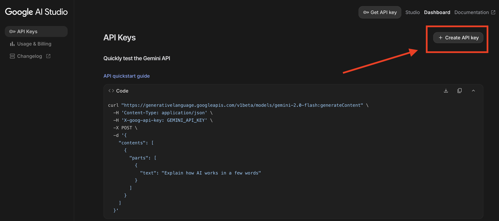

## Getting Gemini API key

Google offer the possibility to use its Gemini models for free within a certain quota. To consult the quota see [here](https://ai.google.dev/gemini-api/docs/rate-limits).

In order to use the Gemini API, however, you need to get an API key. To get the API key, you need to go to [Google AI Studio](https://ai.google.dev/aistudio) and click the "Get API key"


Then by clicking the "Create API key" button you will be able to generate a new API key. Save it in a safe place.



## Verify that the API key is working

Use the command from Gemini API documentation to verify that the API key is working.

```bash
curl "https://generativelanguage.googleapis.com/v1beta/models/gemini-2.0-flash:generateContent" \
  -H 'Content-Type: application/json' \
  -H 'X-goog-api-key: GEMINI_API_KEY' \
  -X POST \
  -d '{
    "contents": [
      {
        "parts": [
          {
            "text": "Explain how AI works in a few words"
          }
        ]
      }
    ]
  }'
```

## Exercise

Create in the root of your project a new file called `.env` and add the following line:

```
GEMINI_API_KEY=YOUR_API_KEY
```