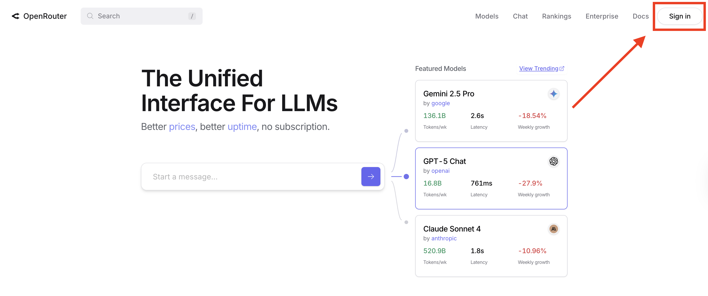
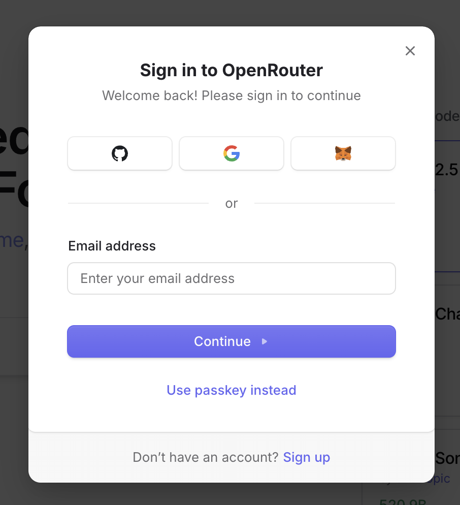
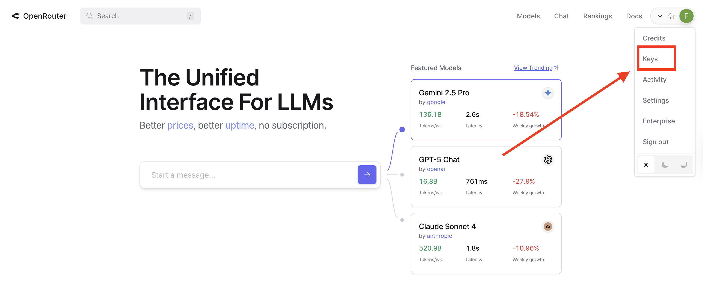
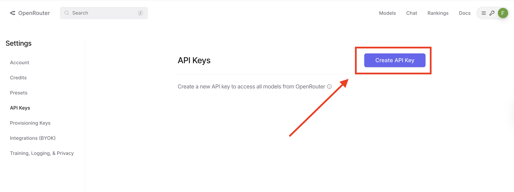

# Index

* [OpenRouter](#openrouter)
* [Getting the API key from OpenRouter](#getting-the-api-key-from-openrouter)
* [Using the OpenRouter API](#using-the-openrouter-api)


## OpenRouter

OpenRouter is a platform that allows to use different models from different providers. It is a wrapper around the API of the different providers. Crucially, all models on OpenRouter follow the OpenAI API specification. We will leverage this to use the models on OpenRouter with LangChain interface that we already know.

You can consult the [official documentation](https://openrouter.ai/docs/quickstart) for more information.

## Getting the API key from OpenRouter

To get the API key, you need to create an account on the [OpenRouter website](https://openrouter.ai/).

Once there click on the "Sign in" button



Decide then a method to sign in. You can use your Google account, your GitHub account, your GitLab account, or your email address.



Once you have signed in, click on your profile picture in the top right corner and then on keys.



Then by clicking on the "Create API key" button you will be able to generate a new API key



Once you have the API key you should add it to your environment variables (or equivalently in the `.env` file) with the name `OPENROUTER_API_KEY`:

```
OPENROUTER_API_KEY=YOUR_API_KEY
```

## Defining a OpenRouter conversation class in LangChain

Exploiting the OpenAI API specification, we can define a new conversation class that uses the OpenRouter API. This class will inherit from the `ChatOpenAI` class and will override the `base_url` and `openai_api_key` attributes.

```python
import os

from dotenv import load_dotenv
from langchain_core.utils.utils import secret_from_env
from langchain_openai import ChatOpenAI
from pydantic import Field, SecretStr

load_dotenv()

class ChatOpenRouter(ChatOpenAI):
    openai_api_key: SecretStr | None = Field(
        alias="api_key", default_factory=secret_from_env("OPENROUTER_API_KEY", default=None)
    )

    @property
    def lc_secrets(self) -> dict[str, str]:
        return {"openai_api_key": "OPENROUTER_API_KEY"}

    def __init__(self, openai_api_key: str | None = None, **kwargs):
        openai_api_key = openai_api_key or os.environ.get("OPENROUTER_API_KEY")
        super().__init__(base_url="https://openrouter.ai/api/v1", openai_api_key=openai_api_key, **kwargs)
```

Let us try to use a free model hosted on OpenRouter.

```python
model_name = "deepseek/deepseek-r1-0528:free"
#model_name = "qwen/qwen3-235b-a22b:free"
#model_name = "z-ai/glm-4.5-air:free"

llm = ChatOpenRouter(model_name=model_name)
llm.invoke("What approved drugs can be used to treat melanoma?")
```

## Exercise

- Find free models on OpenRouter and try to compare them in quality and speed of response on a question of your choice;

- Compare reasoning models with non-reasoning models on a question of your choice;

- (Once you know how tool binding works, lecture 4) try to use tool binding with one of the free models on OpenRouter. Are you able to use the tool binding OpenRouter models?